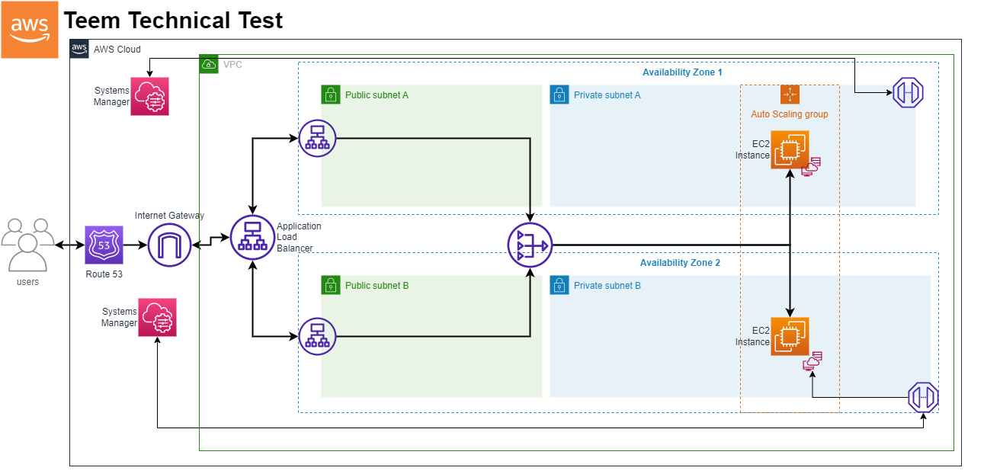

# Teem Multi Tier VPC CloudFormation Templates

These CloudFormation templates create a multi-tier VPC with public and private subnets, an Internet-facing Application Load Balancer, a NAT Gateway with an associated Elastic IP, necessary routing configurations for the private subnets, and an Auto Scaling Group. Instances launched in the VPC will have a simple Nginx setup for demonstration purposes and will return a 'Healthy' response on the root path. There are two versions of the template: one with HTTPS configurations (teem-cfn.yaml) and one without HTTPS configurations (teem-cfn-simple.yaml).

## Getting Started

To use this template, you will need an AWS account and basic knowledge of AWS CloudFormation and AWS VPC.

### Prerequisites

- AWS account
- AWS CLI or AWS Console
- Basic knowledge of AWS CloudFormation and AWS VPC
- A domain name already set up in AWS Route 53 (`only required for teem-cfn.yaml`)
- Approval of the SSL certificate on the email associated with the domain (`only required for teem-cfn.yaml`)
- The latest Amazon Linux AMI (Find the latest Amazon Linux AMI ID for your region here: https://aws.amazon.com/amazon-linux-ami/)

### Installation

To create the stack using the AWS CLI, follow these steps:

1. Clone the repository or download the template file.
2. Open your terminal and navigate to the folder containing the template file.
3. Run the following command to create the stack:

`aws cloudformation create-stack --stack-name <stack-name> --template-body file://<template-file-name> --parameters ParameterKey=LatestAmiId,ParameterValue=<latest-linux-ami-id> --capabilities CAPABILITY_NAMED_IAM`
    
Replace `<stack-name>` with the name you want to give the CloudFormation stack, `<template-file-name>` with the name of the template file (either `teem-cfn.yaml` or `teem-cfn-simple.yaml`), and `<latest-linux-ami-id>` with the ID of the latest Amazon Linux AMI for your region.

Alternatively, you can create the stack using the AWS Console. Follow these steps:

1. Sign in to the AWS Management Console.
2. Open the CloudFormation console at https://console.aws.amazon.com/cloudformation/
3. Choose "Create Stack".
4. Select "Upload a template to Amazon S3" and upload the template file (either `teem-cfn.yaml` or `teem-cfn-simple.yaml`).
5. Enter a stack name and parameters as required, including the latest Amazon Linux AMI ID for your region.
6. Click "Next" and complete the remaining steps as required.

### Usage

After creating the CloudFormation stack, you can log in to the AWS Console to view and manage the resources created by the stack. This includes the Internet-facing Application Load Balancer, NAT Gateway, and security groups created and associated with the instances and the load balancer.

#### Accessing Instances with AWS Session Manager

AWS Session Manager provides a secure and browser-based interactive shell for accessing your EC2 instances without using SSH keys. To access your instances with Session Manager, follow these steps:

1. Sign in to the AWS Management Console.
2. Open the EC2 console at https://console.aws.amazon.com/ec2/
3. Select the instance you want to access.
4. Click "Connect" at the top right of the page.
5. Choose "Session Manager" and click "Connect".

### Known Issues and Troubleshooting

This section lists some known issues and their respective solutions or workarounds when using this CloudFormation template:

1. Instances taking a while to become healthy: It might take some time for the instances launched by the Auto Scaling Group to become healthy and fully functional. Please be patient and allow sufficient time for the instances to start up and pass the health checks.

2. VPC/NAT Gateway error when deleting and quickly recreating the stack: If you delete a stack and quickly create a new one, you might encounter VPC or NAT Gateway errors. This issue occurs because AWS takes some time to delete resources from the previous stack. To resolve this issue, wait a few minutes before attempting to create a new stack after deleting the previous one. If the issue persists, just delete the failed stack and create a new one.

3. Incompatibility with Amazon Linux AMI 2023: This CloudFormation template is currently incompatible with the Amazon Linux AMI 2023. We are aware of this issue and are working on a solution. In the meantime, please use Amazon Linux 2 instead.

#### Outputs

The stack creates the following outputs:

- `VpcId`: The ID of the VPC.
- `PublicSubnetA`: The ID of the public subnet A.
- `PublicSubnetB`: The ID of the public subnet B.
- `PrivateSubnetA`: The ID of the private subnet A.
- `PrivateSubnetB`: The ID of the private subnet B.
- `LoadBalancerDNSName`: The DNS name of the application load balancer.

## Contributing

If you find any issues with this CloudFormation template or have suggestions for improvements, please open an issue or a pull request. To report an issue, click the "Issues" tab in the GitHub repository and then click the "New issue" button. Describe the issue you encountered and provide any relevant details that will help us understand and resolve it.

## License

This CloudFormation template is licensed under the MIT License.

## Acknowledgments

This CloudFormation template was created with reference to the AWS documentation and sample templates.
